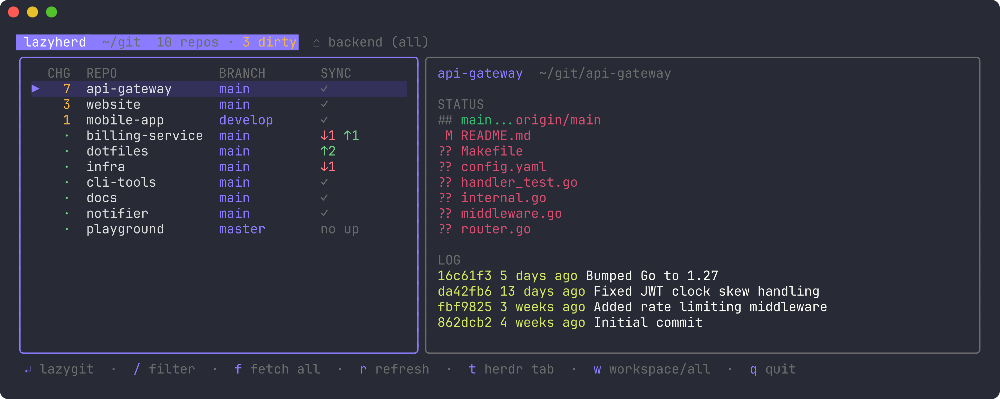

# lazyherd

A [Herdr](https://herdr.dev) plugin: a cockpit over every Git repository in
one directory. A narrow list shows which repos have uncommitted changes and
which are ahead or behind; the repo you select is opened in
[lazygit](https://github.com/jesseduffield/lazygit) in the pane next to it.



## Features

- Scans every Git repository directly under one directory, one `git status` call each, in parallel.
- Repo list with number of changed files, branch, age of the last commit and ahead/behind counts; dirty repos first, then out of sync, then most recently committed.
- Opens in its own Herdr tab: the list on the left, lazygit on the right. Moving the selection switches the repo.
- Sync: fast-forward pull, then push when ahead; for the selected repo or every listed repo.
- Refreshes on its own: status every 3 seconds, `git fetch --all` in every repo once a minute.
- Name filter.
- Herdr workspaces: repos with a pane in the current workspace come first, marked ⌂; Space pins any other repo to the workspace (★); `w` narrows the list to them; `t` jumps to a repo's tab or opens one.
- Looks like lazygit: same frames, status panel, options bar and colors. Reads `~/.config/lazygit/config.yml` for the theme, border style and nerd-font icons, so both panes match.
- Keyboard and mouse selection.

## Install

```sh
herdr plugin install chriopter/lazyherd
```

The install downloads the release binary named by the plugin manifest
(Linux and macOS, amd64 and arm64), or builds it with Go when that release
is not out yet. Requires `git` and `lazygit` on your `PATH`. To update, run
the install again.

Bind the action to a key in Herdr's `config.toml` (`prefix+g` is Herdr's
goto by default, so pick a free one), then `herdr server reload-config`:

```toml
[[keys.command]]
key = "prefix+shift+l"
type = "plugin_action"
command = "chriopter.lazyherd.open"
description = "lazyherd"
```

## Use

The key focuses the current workspace's lazyherd tab, or opens one; so does
`herdr plugin action invoke chriopter.lazyherd.open` from any pane. `q`
closes it again, together with the lazygit pane.

By default the directory scanned is `~/git`. To use another one, put it in
the plugin's config file (`herdr plugin config-dir chriopter.lazyherd`
prints the directory):

```yaml
# config.yml
root: ~/code
```

| Key | Action |
|-----|--------|
| `↵` | Focus the lazygit pane |
| `p` | Sync the selected repo: `git pull --ff-only`, then `git push` if ahead |
| `P` | Sync every listed repo |
| `/` | Filter by name |
| `t` | Jump to the repo's Herdr tab, or open one |
| `w` | Toggle between the current Herdr workspace and all repos |
| `space` | Pin the selected repo to the current Herdr workspace, or unpin it |
| `q` | Quit, closing the lazygit pane |

Notes:

- Only the immediate subdirectories of the scanned directory are considered; symlinked directories are skipped.
- Ahead/behind counts come from the local tracking refs; the background fetch keeps them at most a minute old.
- The lazygit pane runs `lazyherd follow <socket>`, which starts `lazygit -p <repo>` for each selection. Quit lazygit with `q` and the next selection starts it again. If the pane is closed, Enter opens a new one.
- Pins are stored in the plugin's state directory (`~/.local/state/herdr/plugins/chriopter.lazyherd/pins.json`), keyed by workspace name.
- Theme keys honoured from lazygit's config: `gui.border`, `gui.nerdFontsVersion`, `gui.theme.activeBorderColor`, `inactiveBorderColor`, `searchingActiveBorderColor`, `optionsTextColor`, `selectedLineBgColor`, `unstagedChangesColor`, `defaultFgColor`.

### Without the plugin

The binary also runs directly in any Herdr pane, splitting lazygit off to
its right: `lazyherd [DIR]`. Install it with
[mise](https://mise.jdx.dev) (`mise use -g github:chriopter/lazyherd`), with
`go install github.com/chriopter/lazyherd@latest`, or from the
[releases](https://github.com/chriopter/lazyherd/releases). Run this way,
config and pins live in `~/.config/lazyherd/`. Outside Herdr it exits;
there is nothing to split.

## Development

```sh
make test    # go test ./...
make lint    # gofmt and go vet
make link    # build bin/lazyherd and link this checkout as the plugin
```

Releases are cut by bumping `version` in `herdr-plugin.toml` and pushing
the matching `v*` tag; GitHub Actions runs the tests and goreleaser publishes
the binaries that `scripts/build.sh` downloads on install.

## License

MIT
